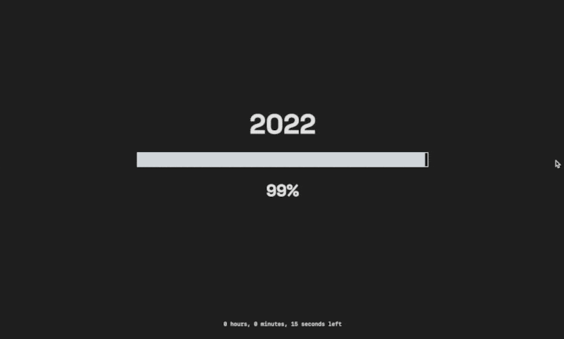

# Year Progress（年度進度）

一個簡單直觀的網頁應用程式，用於顯示當年已經過去的時間百分比及剩餘時間，並可建立自訂進度條追蹤特定事件倒數。



## 功能列表

- **年度進度百分比顯示**：以進度條顯示當年過去的百分比
- **即時倒數計時器**：顯示本年度剩餘的月、日、時、分、秒
- **自定義進度條**：建立專屬的進度條來追蹤個人事件或期限
- **可分享連結**：生成可分享的永久連結，方便分享自定義進度條
- **自動時區調整**：根據用戶的瀏覽器時區自動計算正確的時間
- **新年倒數**：當年末倒數到30秒內時顯示倒數計時
- **煙火效果**：當倒數計時結束時會自動顯示煙火慶祝動畫
- **社交媒體整合**：提供Instagram和GitHub連結
- **OG圖片生成**：自動生成社交媒體分享用的圖片
- **回應式設計**：適用於各種螢幕尺寸的裝置

## 技術架構

- Next.js：React框架
- TypeScript：開發語言
- Luxon：時間處理函式庫
- Tailwind CSS：樣式設計
- MySQL：資料庫儲存自定義進度條
- Docker：容器化部署

## 本地開發

```bash
# 安裝相依套件
npm install

# 啟動開發環境
npm run dev

# 建立生產版本
npm run build

# 啟動生產版本
npm start
```

## Docker 部署

```bash
# 建立 Docker 映像
docker build -t yearprogress:latest .

# 執行容器（需要 MySQL 數據庫）
docker run -d \
  -p 4001:3000 \
  -e DB_HOST="mysql" \
  -e DB_PORT="3306" \
  -e DB_USER="YourUser" \
  -e DB_PASSWORD="YourPassword" \
  -e DB_NAME="YourDatabase" \
  --network=MySql \
  --name yp-app yearprogress:latest
```

詳細的部署指南可參考 `docker_commands.md` 文件。

## 線上版本

可以透過以下網址訪問線上版本：[https://yearprogres.azndev.com](https://yearprogres.azndev.com)